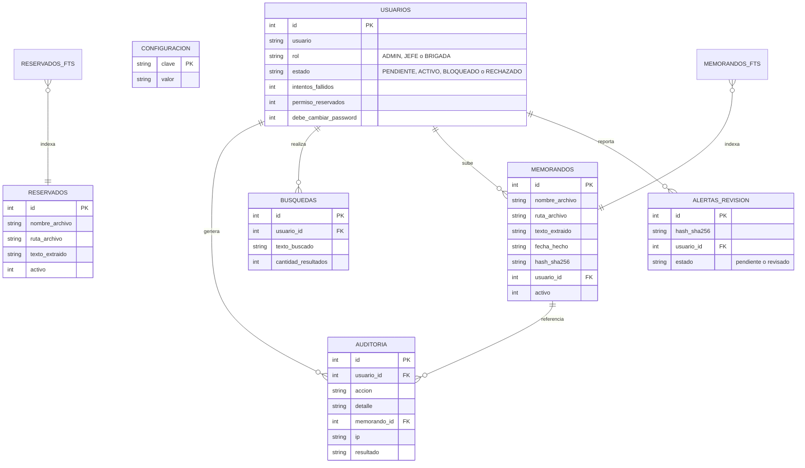
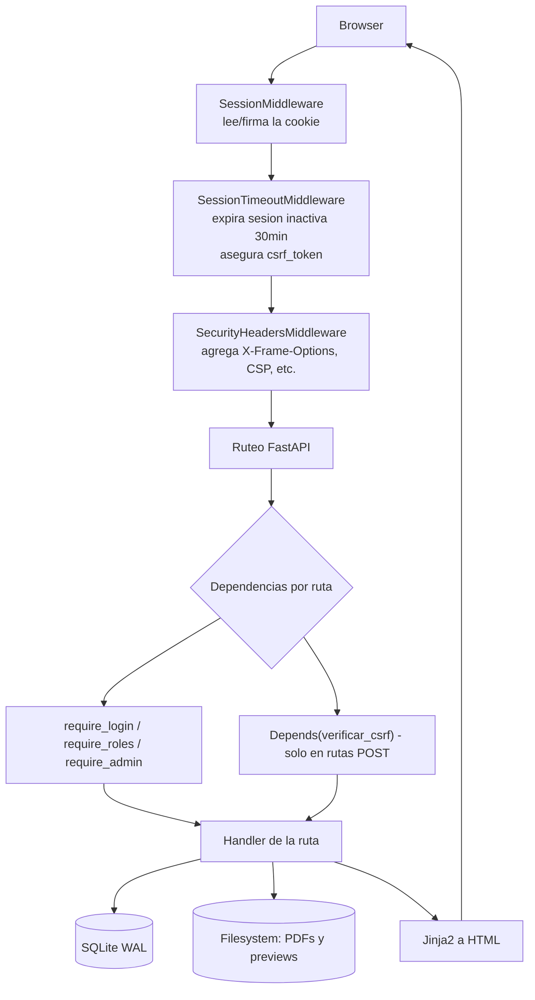

# SIGEMEP — Arquitectura del sistema

Documento de referencia técnica: qué hace el sistema, cómo está armado y
cómo fluye una request. Para instalación ver `README.md`; para la
migración a Ubuntu, `MIGRACION_UBUNTU.md`.

## 1. Qué es

Sistema interno de consulta, carga y auditoría de memorandos en PDF.
Tres roles (`ADMIN`, `JEFE`, `BRIGADA`) con permisos distintos sobre la
misma base documental, más una sección separada de archivos "Reservados"
con acceso restringido.

## 2. Stack

| Capa | Tecnología |
|---|---|
| Backend | Python 3 + FastAPI (Starlette) |
| Sesiones | `SessionMiddleware` (cookie firmada con `itsdangerous`) |
| Base de datos | SQLite, modo WAL, índice de texto completo FTS5 |
| Vistas | Jinja2 (server-side rendering, sin framework JS) |
| PDF | PyMuPDF (`fitz`) — extracción de texto, render de páginas, generación |
| Imágenes | Pillow — marca de agua sobre las vistas previas |
| Contraseñas | `passlib` + `bcrypt` |
| Servidor | Uvicorn (ASGI) |

## 3. Estructura de carpetas

```
app.py                    # todas las rutas FastAPI + middlewares
config.py                 # rutas, secretos y límites configurables
services/
  db.py                    # conexión SQLite, esquema, migraciones
  auth_service.py            # hash/verificación de password, cupos de rol
  audit_service.py             # tabla de auditoría y de búsquedas
  pdf_service.py                  # indexación, extracción de texto, marca de agua
  search_service.py                  # búsqueda FTS5 (con fallback en Python)
  memo_creator.py                       # generación de memorandos nuevos en PDF
templates/                 # vistas Jinja2 (una por pantalla)
static/                     # CSS y JS (sin build step, JS plano)
```

No hay frontend separado ni build de JS: cada pantalla es un template
Jinja2 con su `<script>` propio cuando necesita interactividad (fetch/XHR
contra los mismos endpoints de FastAPI).

## 4. Modelo de datos



`memorandos_fts` / `reservados_fts` son tablas virtuales FTS5 (contenido
externo, apuntan a `memorandos`/`reservados` por `rowid`), no entidades
independientes — se muestran porque la búsqueda pasa por ellas primero.

`configuracion` es clave/valor: ahí vive, entre otras cosas, la carpeta de
PDF y de reservados actualmente configuradas (pisa el default de
`config.py`/`.env` una vez que el admin la cambia desde el panel).

## 5. Roles y permisos

| Acción | ADMIN | JEFE | BRIGADA |
|---|---|---|---|
| Buscar memorandos | ✅ | ✅ | ✅ |
| Ver primera hoja (con marca de agua) | ✅ | ✅ | ✅ |
| Ver/descargar PDF completo | ✅ | ✅ | ❌ |
| Subir / crear memorandos nuevos | ❌ | ❌ | ✅ |
| Ver movimientos de sus brigadas | ❌ | ✅ (solo BRIGADA) | ❌ |
| Gestión de usuarios, auditoría, reindexado | ✅ | ❌ | ❌ |
| Acceso a Reservados | ✅ (siempre) | si `permiso_reservados` | si `permiso_reservados` |

Cupos: máximo 4 `JEFE` y 10 `BRIGADA` simultáneos en estado
`PENDIENTE`+`ACTIVO` (`CUPO_JEFE`/`CUPO_BRIGADA` en `config.py`).

## 6. Flujo de una request



Notas de diseño:
- **CSRF no es middleware**: se probó como middleware y rompía la lectura
  del body en FastAPI (`BaseHTTPMiddleware` consume el stream antes de
  `call_next`). Por eso es una dependencia (`Depends(verificar_csrf)`) que
  FastAPI fusiona con los demás `Form()`/`File()` de cada ruta.
- El **orden de registro de middlewares importa**: en Starlette, el último
  `add_middleware()` queda más externo. `SessionMiddleware` se registra
  último a propósito, para que ya exista `request.session` cuando los
  demás middlewares la usan.

## 7. Funcionalidades principales

- **Indexación de PDF** (`pdf_service.indexar_memorandos`): recorre la
  carpeta configurada, extrae texto con PyMuPDF, genera preview PNG de la
  primera hoja, guarda tamaño/mtime para detectar cambios en la próxima
  pasada (modo rápido) o forzar reproceso completo (modo completo). Corre
  en un thread de background; el progreso se expone en memoria
  (`INDEX_JOBS`) y se consulta por polling desde el navegador.
- **Búsqueda** (`search_service.buscar_memorandos`): FTS5 con
  `unicode61 remove_diacritics`, filtros por fecha/cantidad de páginas, con
  fallback a búsqueda lineal en Python si FTS5 falla.
- **Marca de agua** (`pdf_service._dibujar_marca_agua`): cada vista (primera
  hoja o página completa) se sirve renderizada al vuelo con usuario, rol,
  fecha/hora e IP superpuestos — nunca se entrega el PDF "limpio" salvo la
  descarga explícita habilitada solo para `ADMIN`/`JEFE`.
- **Carga de memorandos nuevos**: dos caminos para `BRIGADA` — generar uno
  desde un formulario estructurado (`memo_creator.py`, PDF armado con
  PyMuPDF) o subir un PDF ya hecho, con deduplicación por hash SHA-256 y
  alerta al admin si hay sospecha de duplicado.
- **Auditoría**: toda acción relevante (login, descargas, bloqueos, cambios
  de rol, indexaciones, accesos denegados) se registra en `auditoria`,
  consultable y exportable a CSV desde el panel admin.

## 8. Seguridad implementada

| Mecanismo | Dónde |
|---|---|
| Hash de contraseñas (bcrypt) | `auth_service.py` |
| Bloqueo de cuenta tras 5 intentos fallidos | `app.py` (`login_post`) |
| Expiración de sesión por inactividad (30 min) | `SessionTimeoutMiddleware` |
| CSRF en las 23 rutas POST | `Depends(verificar_csrf)` |
| Cabeceras HTTP (`X-Frame-Options`, CSP básico, etc.) | `SecurityHeadersMiddleware` |
| Cookie de sesión `Secure` (opcional, `SIGEMEP_COOKIE_SECURE`) | `SessionMiddleware` |
| Secreto de sesión fuera del código fuente | `config.py` (env var o `.session_secret`) |
| Límite de tamaño de subida (50 MB) | `_leer_archivo_con_limite` |
| WAL + `busy_timeout` en SQLite | `services/db.py` |
| Marca de agua + control de descarga por rol | `pdf_service.py` / `app.py` |
| Registro de auditoría de accesos denegados | `audit_service.py` |

## 9. Despliegue

- **Windows (dev)**: `ejecutar_dev.bat` — venv en `C:\SIGEMEP_APP_DEV`,
  Uvicorn con `--reload` en el puerto 8001.
- **Ubuntu (dev)**: `ejecutar_ubuntu.sh` — mismo patrón, crea el venv si no
  existe, carga `.env`, puerto 8001.
- **Ubuntu (producción)**: `sigemep.service` (systemd) — un solo proceso
  Uvicorn en el puerto 8000 (la indexación en background guarda su
  progreso en memoria del proceso, así que no se puede escalar a varios
  workers sin rehacer ese mecanismo).

Detalle paso a paso en `README.md`; qué copiar a mano desde la PC actual
en `MIGRACION_UBUNTU.md`.
